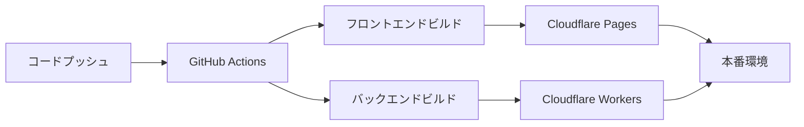

# デプロイメントガイド

お薬管理アプリの本番環境へのデプロイメントについて説明します。

## 🚀 デプロイメント概要

### デプロイメント先

- **フロントエンド**: Cloudflare Pages
- **バックエンド**: Cloudflare Workers
- **データベース**: Cloudflare D1

### デプロイメントフロー



## 🏗️ インフラストラクチャ

### Cloudflare サービス

1. **Cloudflare Workers**
   - バックエンドAPIの実行環境
   - エッジコンピューティングによる高速レスポンス

2. **Cloudflare D1**
   - SQLite互換データベース
   - グローバル分散

3. **Cloudflare Pages**
   - 静的サイトホスティング
   - 自動デプロイメント

## 📋 前提条件

### 必要なアカウント・ツール

- Cloudflare アカウント
- GitHub アカウント
- Wrangler CLI
- Node.js 18.0.0以上
- Bun 1.0.0以上

### 環境変数

#### 本番環境変数

```env
# バックエンド
DATABASE_URL="your_production_database_url"
NODE_ENV="production"

# フロントエンド
VITE_API_BASE_URL="https://your-api-domain.com/api"
```

## 🔧 セットアップ手順

### 1. Cloudflare アカウント設定

```bash
# Wrangler CLI のインストール
npm install -g wrangler

# Cloudflare アカウントにログイン
wrangler login
```

### 2. データベースの作成

```bash
# D1データベースの作成
wrangler d1 create okusuri-db

# データベースIDをメモ
# 例: 12345678-1234-1234-1234-123456789012
```

### 3. データベースマイグレーション

```bash
# マイグレーションの実行
wrangler d1 migrations apply okusuri-db --local
wrangler d1 migrations apply okusuri-db
```

### 4. 環境変数の設定

```bash
# 本番環境の環境変数を設定
wrangler secret put DATABASE_URL
wrangler secret put NODE_ENV
```

## 🚀 デプロイメント手順

### バックエンドのデプロイ

#### 1. Wrangler設定

```toml
# wrangler.toml
name = "okusuri-backend"
main = "src/app.ts"
compatibility_date = "2024-01-15"

[env.production]
name = "okusuri-backend-prod"

[[d1_databases]]
binding = "DB"
database_name = "okusuri-db"
database_id = "your-database-id"
```

#### 2. デプロイ実行

```bash
# 開発環境デプロイ
wrangler deploy

# 本番環境デプロイ
wrangler deploy --env production
```

### フロントエンドのデプロイ

#### 1. ビルド設定

```typescript
// vite.config.ts
import { defineConfig } from 'vite';
import react from '@vitejs/plugin-react-swc';

export default defineConfig({
  plugins: [react()],
  build: {
    outDir: 'dist',
    sourcemap: false,
    minify: true,
  },
  define: {
    'import.meta.env.VITE_API_BASE_URL': JSON.stringify(process.env.VITE_API_BASE_URL),
  },
});
```

#### 2. ビルド実行

```bash
# 本番用ビルド
bun run build
```

#### 3. Cloudflare Pages へのデプロイ

```bash
# Cloudflare Pages にデプロイ
wrangler pages deploy dist --project-name okusuri-frontend
```

## 🔄 CI/CD パイプライン

### GitHub Actions 設定

```yaml
# .github/workflows/deploy.yml
name: Deploy to Cloudflare

on:
  push:
    branches: [main]

jobs:
  deploy-backend:
    runs-on: ubuntu-latest
    steps:
      - uses: actions/checkout@v3
      
      - name: Setup Bun
        uses: oven-sh/setup-bun@v1
        with:
          bun-version: latest
      
      - name: Install dependencies
        run: bun install
      
      - name: Deploy to Cloudflare Workers
        run: |
          cd backend
          wrangler deploy --env production
        env:
          CLOUDFLARE_API_TOKEN: ${{ secrets.CLOUDFLARE_API_TOKEN }}

  deploy-frontend:
    runs-on: ubuntu-latest
    steps:
      - uses: actions/checkout@v3
      
      - name: Setup Bun
        uses: oven-sh/setup-bun@v1
        with:
          bun-version: latest
      
      - name: Install dependencies
        run: bun install
      
      - name: Build frontend
        run: |
          cd frontend
          bun run build
        env:
          VITE_API_BASE_URL: ${{ secrets.VITE_API_BASE_URL }}
      
      - name: Deploy to Cloudflare Pages
        run: |
          cd frontend
          wrangler pages deploy dist --project-name okusuri-frontend
        env:
          CLOUDFLARE_API_TOKEN: ${{ secrets.CLOUDFLARE_API_TOKEN }}
```

### 必要なシークレット

GitHub リポジトリの Settings > Secrets で以下を設定：

- `CLOUDFLARE_API_TOKEN`: Cloudflare API トークン
- `VITE_API_BASE_URL`: 本番APIのベースURL

## 🔒 セキュリティ設定

### CORS設定

```typescript
// backend/src/app.ts
import { cors } from 'hono/cors';

app.use(cors({
  origin: ['https://your-frontend-domain.com'],
  credentials: true,
}));
```

### 環境変数の管理

```bash
# 本番環境のシークレット設定
wrangler secret put DATABASE_URL
wrangler secret put JWT_SECRET
wrangler secret put API_KEY
```

## 📊 監視・ログ

### Cloudflare Analytics

- **Workers Analytics**: API のパフォーマンス監視
- **Pages Analytics**: フロントエンドのアクセス解析

### ログ設定

```typescript
// ログレベルの設定
const logLevel = process.env.NODE_ENV === 'production' ? 'warn' : 'debug';

app.use(logger({
  level: logLevel,
}));
```

## 🔄 ロールバック

### バックエンドのロールバック

```bash
# 前のバージョンにロールバック
wrangler rollback

# 特定のバージョンにロールバック
wrangler rollback --version <version-id>
```

### フロントエンドのロールバック

```bash
# Cloudflare Pages のダッシュボードから
# デプロイ履歴から前のバージョンを選択してロールバック
```

## 🧪 ステージング環境

### ステージング環境の設定

```toml
# wrangler.toml
[env.staging]
name = "okusuri-backend-staging"

[[env.staging.d1_databases]]
binding = "DB"
database_name = "okusuri-db-staging"
database_id = "staging-database-id"
```

### ステージングデプロイ

```bash
# ステージング環境にデプロイ
wrangler deploy --env staging
```

## 📈 パフォーマンス最適化

### バックエンド最適化

1. **キャッシュ設定**
   ```typescript
   // レスポンスキャッシュの設定
   app.get('/api/health', (c) => {
     c.header('Cache-Control', 'public, max-age=300');
     return c.json({ status: 'healthy' });
   });
   ```

2. **データベース最適化**
   - 適切なインデックスの設定
   - クエリの最適化

### フロントエンド最適化

1. **バンドルサイズの最適化**
   ```typescript
   // vite.config.ts
   export default defineConfig({
     build: {
       rollupOptions: {
         output: {
           manualChunks: {
             vendor: ['react', 'react-dom'],
             ui: ['@radix-ui/react-dropdown-menu'],
           },
         },
       },
     },
   });
   ```

2. **画像最適化**
   - WebP 形式の使用
   - 適切なサイズでの配信

## 🔍 トラブルシューティング

### よくある問題

#### 1. デプロイエラー

```bash
# ログの確認
wrangler tail

# デバッグモードでデプロイ
wrangler deploy --compatibility-date 2024-01-15
```

#### 2. データベース接続エラー

```bash
# データベースの状態確認
wrangler d1 info okusuri-db

# マイグレーションの確認
wrangler d1 migrations list okusuri-db
```

#### 3. 環境変数の問題

```bash
# 環境変数の確認
wrangler secret list
```

## 🔗 関連ドキュメント

- [セットアップガイド](./setup.md)
- [システム概要](./architecture.md)
- [バックエンド開発](./backend.md)
- [フロントエンド開発](./frontend.md)